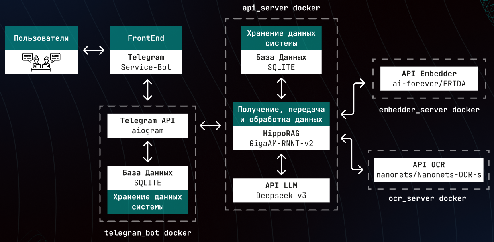

<a name="readme-top"></a>  

# Minerva


**Содержание** |
:---:|
[Обзор](#title1) |
[Данные](#title2) |
[Архитектура системы](#title3) |
[Результаты](#title4) |
[Способны запуска](#title5) |
[Документация](#title6) |

## <h3 align="start"><a id="title1">Обзор</a></h3>

Minerva представляет из себя систему, ядром которая является модификация реализации архитектуры HippoRAG.

<p align="right">(<a href="#readme-top"><i>Вернуться к содержанию</i></a>)</p>

## <h3 align="start"><a id="title2">Данные</a></h3>

Было собрано 388 статей, из которых удалось сгенерировать 1552 уникальных вопроса.
Кейсодержатель также предоставил датасет, состоящий из 3073 вопросов. Затем проведен процесс дедупликации с использованием ANN. В итоге собран датасет из 2663 вопроса и статьи к ним.

<p align="right">(<a href="#readme-top"><i>Вернуться к содержанию</i></a>)</p>

## <h3 align="start"><a id="title3">Архитектура системы</a></h3>



Серверная часть, отвечающая за API и бизнес-логику, построена на фреймворке FastAPI и является полностью асинхронной. Взаимодействие с пользователем через Telegram реализовано с помощью библиотеки aiogram.

В качестве модели для распознования аудиозапросов была выбрана [GigaAM RNNT 2](https://github.com/salute-developers/GigaAM), т.к. на текущий момент она является SOTA решением для задачи Automatic Speech Recognition.

<p align="right">(<a href="#readme-top"><i>Вернуться к содержанию</i></a>)</p>

## <h3 align="start"><a id="title4">Результаты</a></h3>


В качестве judge модели была выбрана Claude Sonnet 3.7 и затем с помощью few-shot режима модель была выровнена под модель от кейсодержателя

<p align="right">(<a href="#readme-top"><i>Вернуться к содержанию</i></a>)</p>

## <h3 align="start"><a id="title5">Способы запуска</a></h3>

Перед тем, как запускать решение, требуется настроить переменные в .env файле.
Все последующие блоки команд выполняет из корня репозитория

### Docker

Докер образ составлен под Cuda 12.4. Команда для запуска:
```
docker-compose up -d
```
Если требуется просмотреть логи:
```
docker-compose logs -f
```
<p align="right">(<a href="#readme-top"><i>Вернуться к содержанию</i></a>)</p>

### Ручная установка

Необходимо поменять значения следующих переменных в .env файле:
```
IS_DOCKER_RUN=False
EMBEDDING_BASE_URL=http://127.0.0.1:8888
RAG_URL=http://127.0.0.1:9875/request_processing/
TRANSCRIPTION_URL=http://127.0.0.1:9875/transcribe/
```

Установка зависимостей
Запуск RAG сервера
```
cd api_server
pip install -r requirements.txt
python main.py
```
Запуск сервер для эмбеддера
```
cd embedder_server
pip install -r requirements.txt
python main.py
```
Запуск телеграмм бота
```
cd telegram_bot
pip install -r requirements.txt
python bot.py
``` 
<p align="right">(<a href="#readme-top"><i>Вернуться к содержанию</i></a>)</p>

## <h3 align="start"><a id="title6">Документация</a></h3>
```
sudo apt-get install doxygen graphviz
mkdir docs/doxygen
doxygen
```
<p align="right">(<a href="#readme-top"><i>Вернуться к содержанию</i></a>)</p>

## TODO

* Извлечение PDF путем использования Docling + OCR
* Использование векторной базы данных вместо sqlite

<a name="readme-top"></a>
